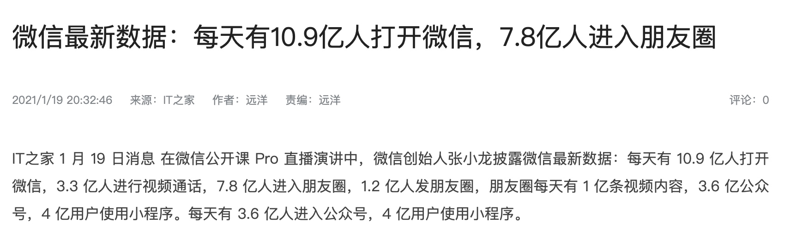
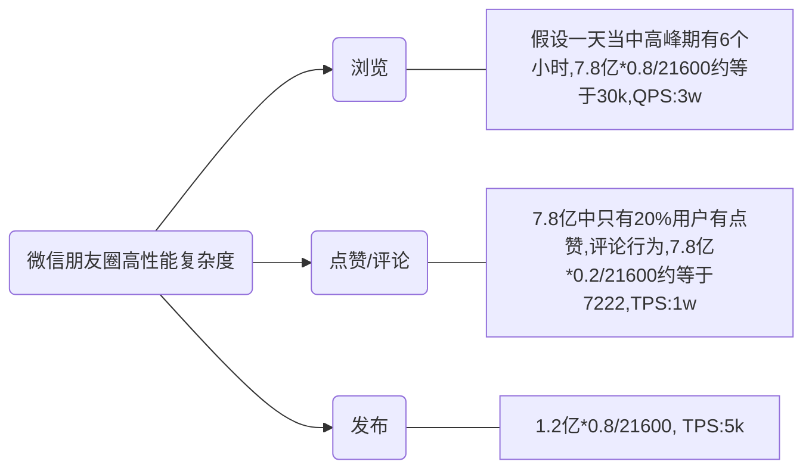
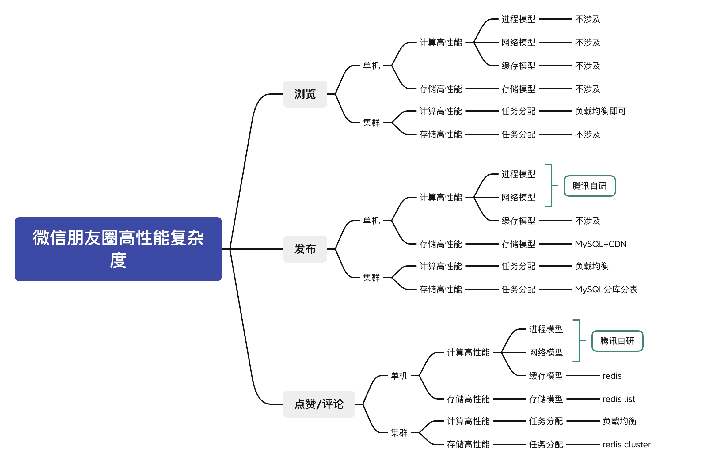
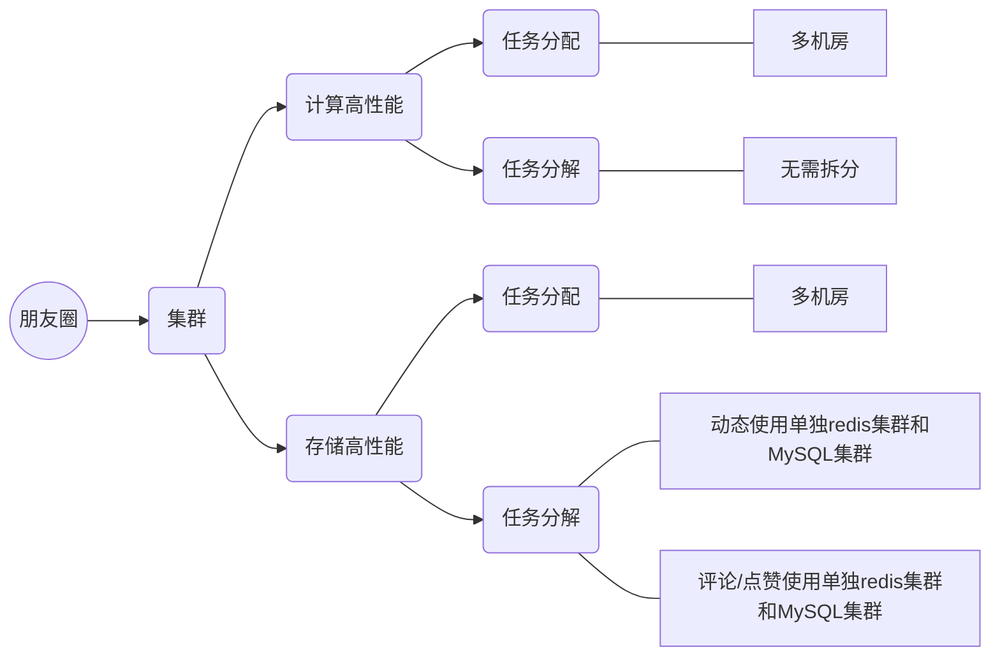
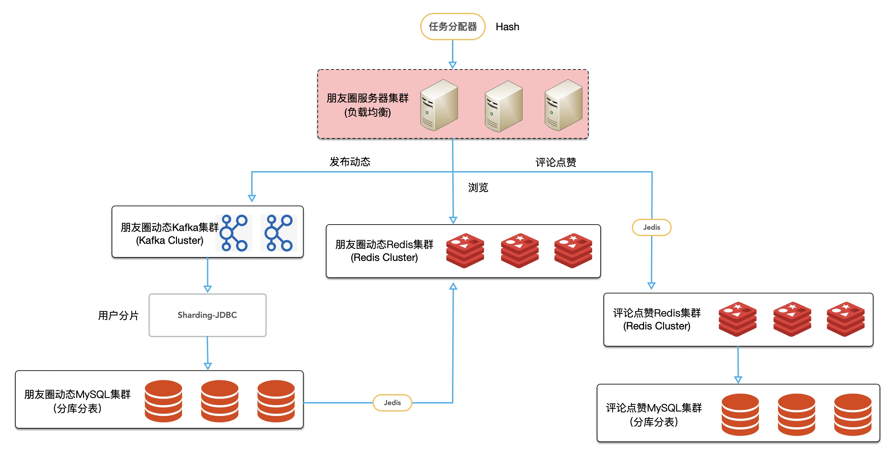

# 模块2作业 微信朋友圈高性能复杂度分析

## 朋友圈业务指标

    
每天有7.8亿人进入朋友圈,1.2亿人发布朋友圈

## 高性能复杂度分析

## 整体方案

    
## 整体架构

## 说明
1. 朋友圈发布,可引入cdn,图片,视频等上传到cdn后,返回url和文字等信息一起保存,由于信息量不复杂,写入MySQL即可,由于并发写入量大,引入kafka,削峰填谷.存储采用最终一致性即可
2. 点赞和评论的写入量高于朋友圈发布量,要求及时性,评论还需要顺序性,采用redis存储,定时写入数据库
3. 浏览朋友圈,QPS比较高,所以直接访问Redis
