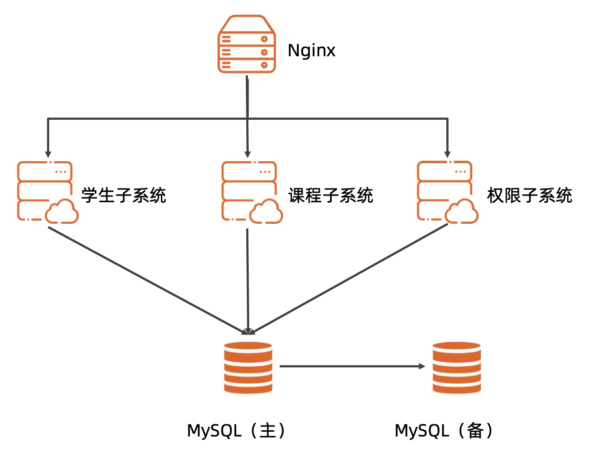

# 外包学生管理系统架构文档

## 前言
本文是学生管理系统详细架构设计文档,用于指导后续开发、测试、运维

## 词汇表
无

## 1. 业务背景
随着学校的规模的不断扩大，学生数量的增加，需要处理的信息也日趋增大。不仅花费大量的教师资源，处理效率也十分低下。
为提高学生管理的管理水平，优化资源，尽可能降低管理成本成为学生管理的新课题，学生管理系统是从学生管理现状出发，根据学生管理的新要求进行开发设计的，它需要解决学生信息管理数据信息量大修改不方便，对一系列数据进行分析时花费时间长等问题，帮助学生管理人员有效管理学生信息。
因此学生信息管理系统可以通过系统规范化地管理、科学性统计和快速查询、修改、增加、删除等，提高信息的准确度以及日常管理的工作效率。
本系统主要是应用于学生各类信息的管理，总体任务是实现学生信息关系的系统化、规范化、自动化，其主要任务是统计学生各类信息进行日常管理，如查询、修改、增加、删除、以及学生选课、成绩的查询等功能设计的管理系统。

## 2. 约束限制
1. 降低成本
2. 可扩展: 业务需求比较复杂
3. 数据高可用: 数据不要全部丢失

## 3. 总体架构

### 3.1 架构分析
1. 高可用
    只需要保证基本的可用性,保障学生,老师的正常使用,无需做到7x24小时不间断服务
2. 可扩展
    模块化设计,后期业务需要方便扩展
3. 高性能
    在校师生人数最多几万人,不会有很高的QPS、TPS
4. 成本、安全
    尽量降低成本,安全性保证师生信息不泄漏
### 3.2 总体架构
1. Nginx: 负责静态页面提供, 前端请求分发到后端子系统中
2. 学生子系统: 课程查询,选课,成绩查询,文件上传/下载,考试
3. 课程子系统: 课程录入、选课、排课、教材选择
4. 权限子系统: 教师、学生、辅导员、管理员赋予不同的权限
5. MySQL: 采用主备架构,保证数据可靠性

## 4. 详细设计

### 4.1 核心功能
无
### 4.2 关键设计
1. 学生子系统
    1. 系统登录:此功能面向所有用户角色，根据用户角色权限不一，功能权限也不一样。
    2. 账号分配:学生账号由系统生成，给定相应权限，可进行密码更改，无法对系统成绩评定等功能做出相应干 涉。教师账号由管理者(教务)通过系统生成，教师有对学生成绩评定和试卷评定的权限，同时兼容学生权 限。管理(教务)权限由系统固有账号，是系统 root 权限，对教师有分配管理权限，对数据有增加、修改、 删除、查询权限。
    3. 账号绑定:学生账号可通过第三方如:手机号码、微信等自行绑定，可实现账号自助找回等。
    4. 组织管理层级:按学生实际情况划分归属。 例如:软件学院—数字传媒方向(专业)—软件1306—苗雨 乔。
    5. 文件上传/下载:此功能针对所有用户开放，学生可以将自己课堂笔记、日常作业等相关信息在线传输，教 师通过学生上传的相关作业、试卷信息进行相应评定，完成对学生平时成绩的评定。此功能一旦评定结束，所 有用户只有查询、浏览的权限，除管理员外其他用户没有对成绩修改的权限。
    6. 信息查询:此项功能包含课程查询(含课程体系、课时安排、课表、教师、教材等)、成绩查询、文件查询。
    7. 试卷区域分割:发起考试:期中的时候，教师可以创建一次考试;而在月考时可以根据上课的周数进行考 试安排，如一般可以在在第八周、十二周、十六周分别创建三次考试。其中这些考试题目是在事先录入好的 题库中按照教师设定的知识点、范围、难易程度以及题型自动生成的试卷。每创建一次考试之后，教师需要 将出好的考试题进行分割点标注，然后印刷试卷，考试。考试过后，试卷会被扫描，然后教师需要将扫描件 试卷录入系统之中，系统会根据标注点对试卷进行预处理和分割。教师进入系统，可以对已经分割好的试卷 进行判分。
    8. 平时成绩:此项功能包含学生平时所有相关成绩信息，例如:考勤主要是由教师终端自动生成的或者教师 手动输入，时间期限为当天;课堂笔记主要是由学生在当堂课程结束后将自己的笔记上传然后由教师批阅给 予成绩在下次上课前完成自动签名;课后作业主要是在每堂课之后，教师可以发起一次作业任务，学生应老 师设定的时间内提交作业，老师会对作业进行批阅，在下次课前给予成绩评分，将以上方式计算得到的总成 绩计入平时成绩。最后按照系统判定的平时成绩结合月考、期中、期末试卷成绩按相应比例得出学生最终成 绩。
2. 课程子系统
    1. 课程录入:由管理员对相应课程体系进行录入，供学生、教师进行在线选择。
    2. 选课功能:学生可以在线对自己的课程体系进行选择，相对应的课程选择功能类比。
    3. 排课功能:此功能根据学生选定的课程和教学体系安排，对相应教师、教室、时间进行统一规划安排。 排课功能备选开发方向为在线排课和人工录入，在线排课是系统根据课程要设置课程的名称、课时、上课 的班级、代课老师等信息，除此之外，还可以选填排课时的优选项，例如:上课时间有限上午等系统自动 生成课程信息，管理员有权限对课程安排作出添加、删除、修改等判定。
    4. 教材选择:此功能由教务统一管理，根据每门课程选定相应教材。
3. 权限子系统 
    1. 系统使用者有学生、教师、管理员、辅导员。
    2. 学生、教师、辅导员可以注册、登录、修改自己的信息，但注册信息需要管理员审核通过。 3. 学生只能查看自己的成绩，教师可以修改学生的成绩。
    3. 辅导员可以查看学生的信息，可以设置学生的奖惩信息。
    4. 教师可以上传考试试题，学生可以做题。

### 4.3 设计规范
1. 三个服务使用go语言开发,使用gin框架,mysql使用gorm
2. 前后端分离开发
3. 微服务使用标准的REST API
4. MySQL使用Binlog进行备份
5. Nginx对外使用https,对内转发使用http

## 5. 质量设计
### 可测试性
每个服务写好单元测试,微服务之间做好集成测试
### 可维护性
单独微服务挂了均不影响其他微服务,做好监控,能及时响应,排除故障
### 可观测性
定时巡检,检查硬盘容量,服务是否正常
### 成本
一次购入服务器
## 6. 演进规划
加入评分判定功能
> 评分判定:教师使用系统对上传的试卷分割区域作出相应的评分。由于教师要对试卷进行签字，我们建 议教师在评分之前可以在试卷上进行签字，由此得到的扫描结果就有教师签字。如有额外需求，需要教师通 过外设进行试卷签字

加入Prometheus+Grafana,方便监控服务器状态
