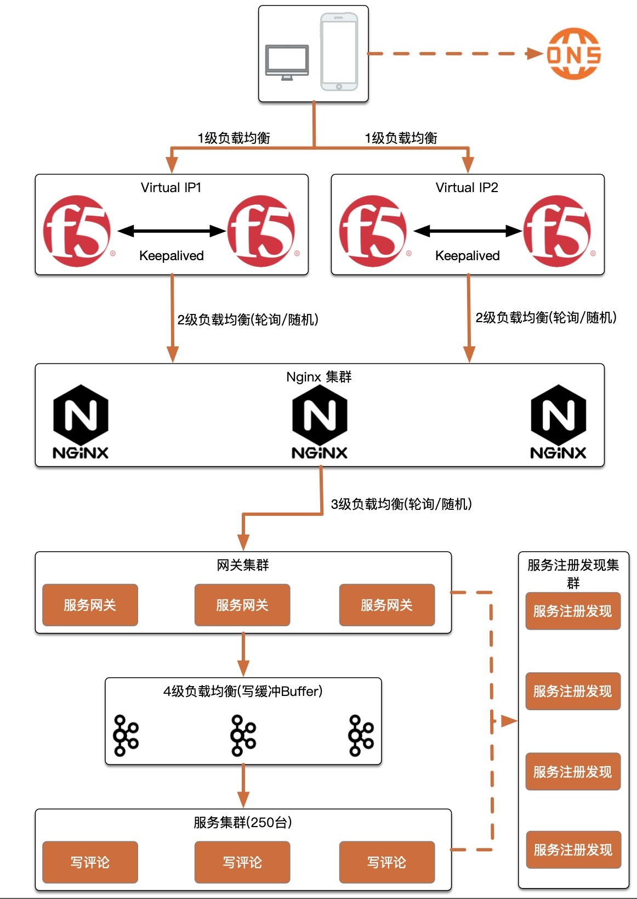
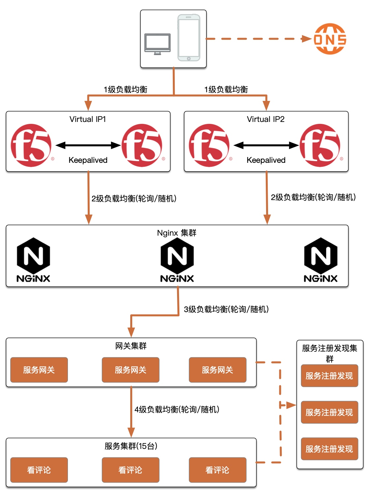
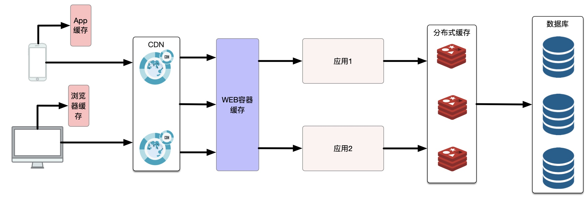

# 设计微博系统中“微博评论”的高性能高可用计算架构。

## 用户行为建模和性能估算
+ 发评论
    微博评论是在看微博的基础上,假设有10%的人看完微博后会发表评论,所以评论的次数为:```250亿 * 10% = 25亿```,由于发评论和看微博时间段完全重合,所以TPS为:``` 25亿 * 60% / (4 * 3600) = 100K/S```
+ 看评论
    看评论的规模是发评论的20倍,主要评论集中在大V、明星等热门微博,但是由于评论是分页的,所以认为只有前100条评论会被看到,100条评论分为5页,每次按页获取,所以看评论的次数为:```发微博的次数 * 5 = 7.5亿```,根据看评论和发微博的用户行为相同,所以QPS为:```7.5亿 * 60% / (4 * 3600) = 10K/S```
    
 
## 发评论
+ 业务特性分析
评论微博是一个典型的写操作，因此不能用缓存，可以用负载均衡。 
+ 架构分析
用户量过亿，应该要用多级负载均衡架构，覆盖 DNS -> F5 -> Nginx -> 网关的多级负载均衡。
+ 架构设计
1. 负载均衡算法选择 
    评论微博的时候依赖登录状态，登录状态一般都是保存在分布式缓存中的，因此评论微博的时候，将请求发送给任意服务器都可以，这里选择“轮询”或者“随机”算法。
2. 业务服务器数量估算评论微博涉及几个关键的处理:数据写入存储(依赖存储系统)、数据写入缓存(依赖缓存系统)，因此按照一个服务每秒处理500来估算，完成100K/s的 TPS，需要200台服务器，加上一定的预留量，250台服务器差不多了。

+ 多集负载均衡架构图



## 看评论
+ 业务特性分析
    看评论是一个典型的读场景，由于主要看评论集中在热门微博中,评论按照分页读取,因此非常适合用缓存架构，同时由于请求量很大，负载均衡架构也需要。
+ 架构分析
    1. 用户量过亿，应该要用多级负载均衡架构;
    2. 请求量达到7.5亿，应该要用多级缓存架构，尤其是 CDN 缓存，是缓存设计的核心。
+ 架构设计
    1. 负载均衡算法选择 
        游客都可以直接看微博，因此将请求发送给任意服务器都可以，这里选择“轮询”或者“随机”算法。
    2. 业务服务器数量估算
        假设CDN能够承载90%的用户流量,流量主要集中在大V,明星等热门微博,顾只需要读微服定时(1小时)往CDN中刷入热门微博评论列表即可,10%的流量即```10K * 10% = 1K/S```处理即可,即1台服务器,定时刷新服务处理90%的读请求,即```10K * 10% = 9K/S```,即9台服务器定时更新CDN.加上一定的预留,15台即可.
    
+ 多集负载均衡架构图
    
+ 看评论多级缓存架构图
    

 