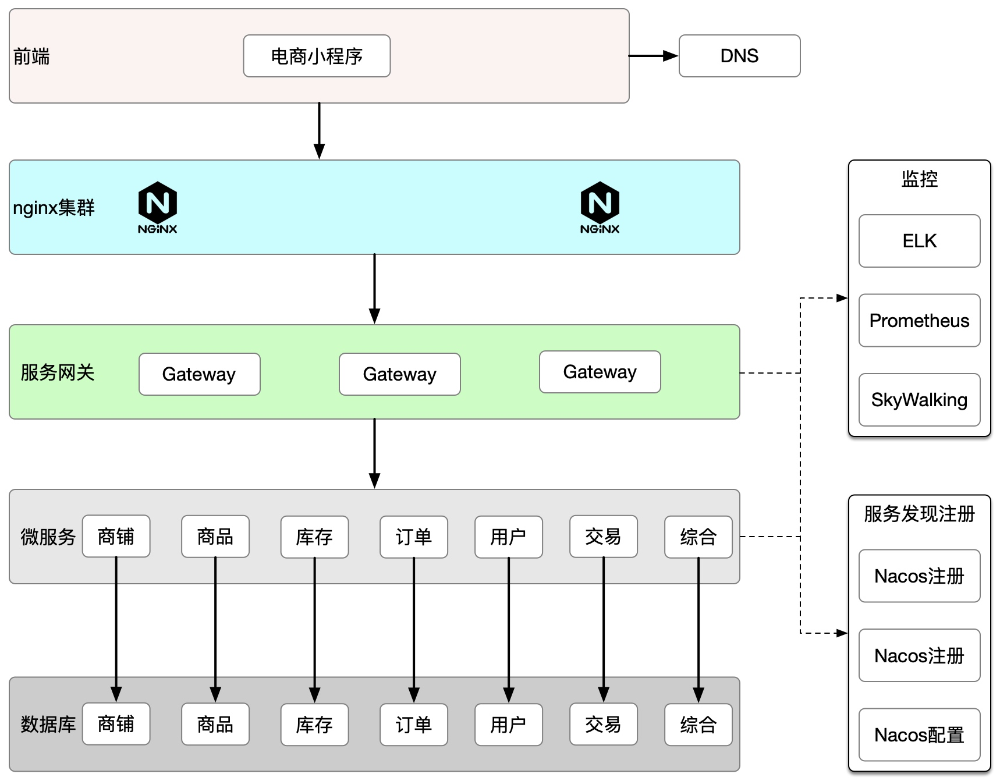

# 拆分电商系统为微服务

## 背景
假设你现在是一个创业公司的 CTO，开发团队大约30人左右，包括5个前端和25个后端，后端开发人员 全部都是 Java，现在你们准备从0开始做一个小程序电商业务，请你设计微服务拆分的架构以及微服务 基础设施选型。

## 拆分思路
一共25个后台开发人员,按照三个火枪手的理论,最多开发8个微服务,由于电商平台是成熟的业务,参考已有的电商业务域的划分,拆分微商铺，商品，库存，订单，用户，交易，综合7个服务,还有4个人负责基础设施的开发

## 微服务框架选型
由于后端都是Java,所以直接选择SpringCloud
+ 考虑到运维复杂性,使用Nacos实现服务注册发现和配置中心,要不然还要起eureka、config
+ 网关考虑选择Spring Gateway和Zuul,Spring Gateway是SpringCloud全家桶,网关选择Gateway
+ 监控服务,选择当下流行的Promethues+Granfana
+ 日志聚合选择EFK,业界成熟方案
+ 链路追踪选择Skywalking,埋点无侵入，UI功能较强, Cat需要埋点

## 拆分系统架构图

## 后期技术演进
由于是初创团队,刚开始业务量不会很大,等微服务版本稳定,业务量稳定增长,可以考虑微服务和数据库中间加入redis缓存集群,加入hystrix熔断等来保证业务的高可用