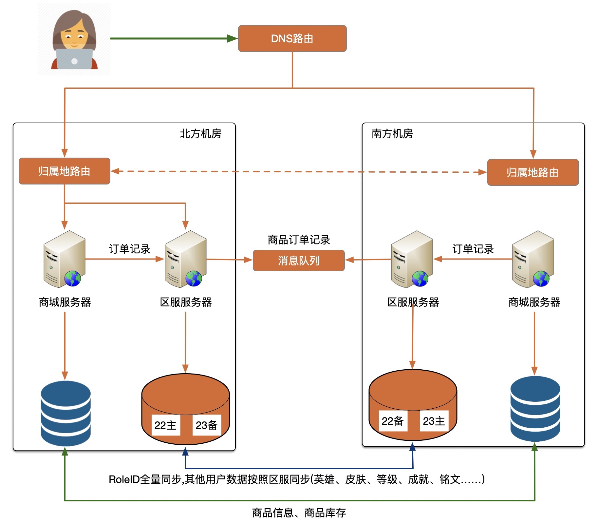

# 王者荣耀商城异地多活架构设计
## 背景
游戏登陆后才能进入商城购买,所以商城的登陆依赖游戏登陆即可
商城的主要功能是:
+ 购买英雄 
+ 皮肤
+ 道具等
由于是虚拟物品,没有库存概念,没有物流信息,自动发货
在商城中购买物品需要用点卷,点卷的充值依赖微信或者qq,高可用不需要自己实现

## 业务分级
1. 商品信息展示
2. 商品购买
3. 点卷余额

## 数据分类
1. 商品: 全局唯一,不可重复,不可变更,每次算法生成即可
2. 订单: 不可重复,算法生成
3. 点卷余额: 最终一致性,不可丢失

## 数据同步
||数据修改量|一致性|唯一性|可丢失|可恢复|同步技巧
:-:|:-:|:-:|:-:|:-:|:-:|:-:|
商品|小|强一致性|全局唯一|否|是,运营恢复|数据库同步
订单|大|最终一致性|-|否|否|数据库同步+消息队列
点卷|大|最终一致性|-|否|运营恢复|数据库同步

## 异常处理
1. 点卷不一致
    用户点卷允许一定额度的透支,因为没有实际的商品,点卷充值后不能提现,用户在异地多活透支,恢复后可发现
2. 重复购买了英雄和皮肤怎么办
    合并英雄熟练度和经验
3. 鲜花、改名卡道具重复购买
    合并数量即可
    
## 架构图

