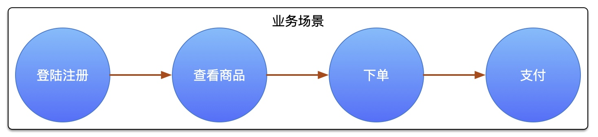
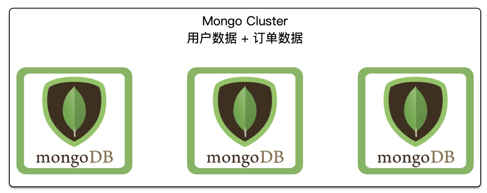
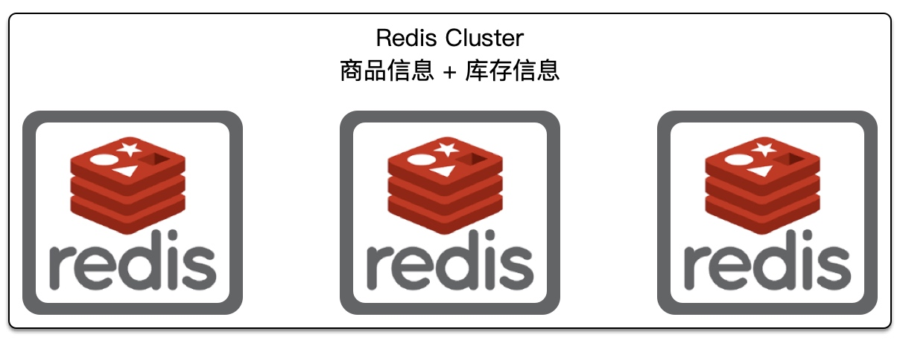
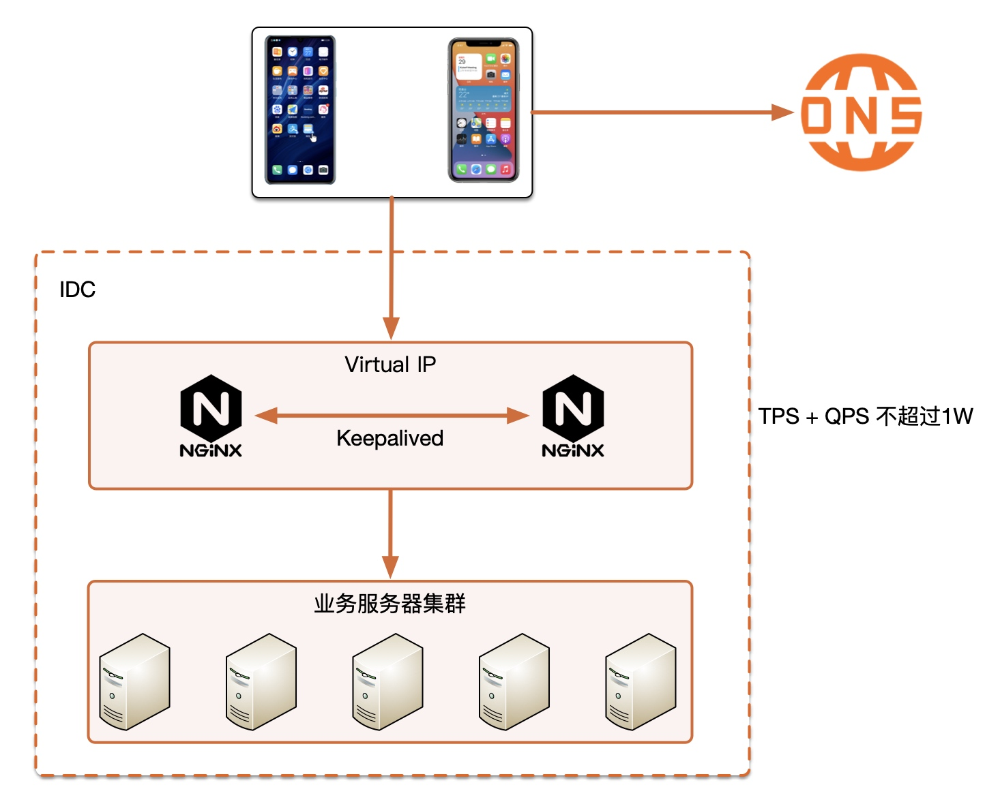
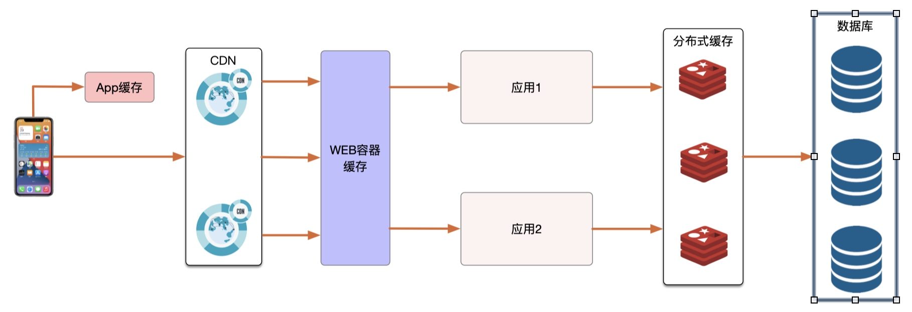
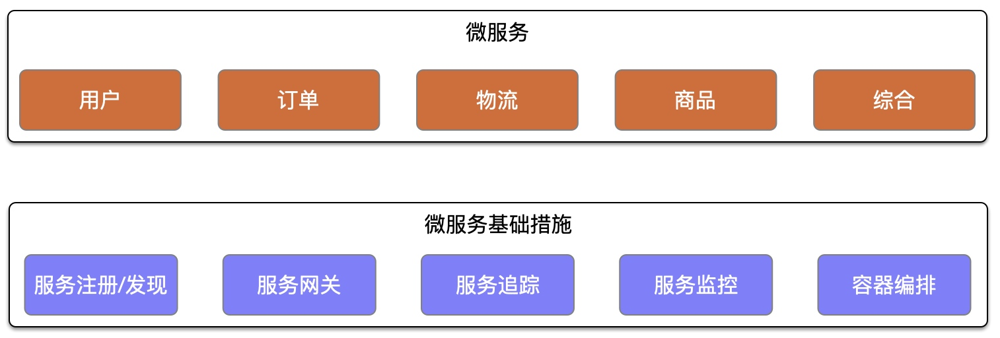

# 模块9 毕业设计
## 业务场景

1. 用户必须下载 App 登陆后才能才看商品，下单购买商品
2. 查看商品会显示商品库存，如库存为0，提示缺货，无法下单
3. 下单成功，扣减库存，调用第三方支付进行付款
4. 下单成功超过5分钟未付款，自动取消订单，释放库存
5. 秒杀活动会提前发布，活动有开始结束时间，用户可能会在活动开始前几分钟频繁刷新界面

## 整体架构思路
日活 100w 左右，单机房，按照 30% 的活跃用户计算，大概不到 400w 用户，按照百万级别架构模式设计

## 存储架构设计
### 存储性能评估
#### 注册
用户注册量不会很大
#### 登陆
日活百万，每个用户每天首登陆会来服务器同步一次用户信息，请求总量大概 100w 左右。
#### 查看商品
10 个种类，每个种类不超过 20 个商品，假如每个商品的文字信息在 300K ，10 * 20 * 0.3M = 60M, 假设每个商品的图片信息最大 20 张，每张图片压缩后不能超过 1M，20 * 1M * 10 * 20 = 4G
假设用户每天查看 10 个商品，50 张图片， 文本信息大小 1000000 * 0.3M = 300G，取 400G，图片大小 10 * 50 * 1M * 1000000 = 50T，取 60T
#### 订单信息
每天每个用户下单数量为 1 单，订单信息假如每单10K，每天订单量 10K * 1000000 = 10G， 取 15G。
### 存储架构设计

## 计算架构设计
### 计算性能评估
#### 登陆/注册
可以忽略不计，因为注册量不大，而 100w 用户登陆不会集中在一个时段，可能平均分配到一天的12个小时当中， 1000000 / (12 * 60 * 60) = 24, 取 30QPS
#### 查看商品
平均每个活动用户在秒杀前5分钟会疯狂刷新，可以用 App 做刷新频率限制，假设 10s App 去服务器请求一次，1 分钟 6 次，5 分钟 30 次，
QPS = 100w * 30 / (5 * 60) = 10W ,由于都是静态资源，可以提前设置到，使用 CDN， 能达到服务器的请求仅为 1%，即 1000QPS
#### 订单信息
秒杀商品为 1010 件，故 1s 内会产生 1010 单商品， TPS = 1010， 取 1500TPS， 根据mongoDB官方数据，数据库完全能够承受
#### 支付
第三方调用，不考虑

### 计算架构负载均衡

### 计算架构之缓存设计

秒杀商品信息可以提前发下发 App 中缓存。 CDN 和 WEB 容器缓存静态资源，秒杀商品信息提前在 Redis 中生成，库存，用户余额，优惠卷等也可以提前放入Redis。

## 可扩展设计

## 高可用设计
由于只有单机房，无法保证机房的稳定性，如果有时间成本，可以做到同城双机房双活
